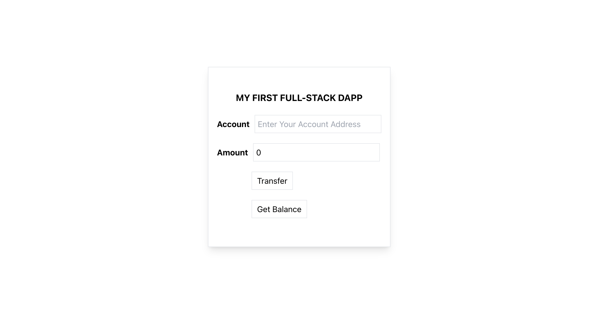

# My First Full_Stack Dapp

> In this project, I built a smart contract that have 1000000 tokens. and it a have a fuctionality to transfer to any account and shows a balance of each account.



Additional description about the project and its features.

## Built With

- Solidity
- Smart contract
- Hardhat
- ether.js
- infura
- React.js
- Tailwind
- Css3
- rinkeby

## Live Demo

[Live Demo Link](https://mystifying-knuth-91d732.netlify.app)

## Prerequisites

```
Web Browser
Meta Mask(google chrome extension)
```

## Install

```
$ npm install

```

## Getting Started

## To get local copy up and running follow these simple example steps

```
git clone git@github.com:Addis-Belete/react-dapp.git
```

```
cd react-dapp
```

```

👤 **Addis Belete**

- GitHub: [@Addis0943](https://github.com/Addis0943)
- Twitter: [@Addis32018084](https://twitter.com/Addis32018084)
- LinkedIn: [LinkedIn](https://www.linkedin.com/in/addis-belete-134b98191/)

## 🤝 Contributing

Contributions, issues, and feature requests are welcome!

Feel free to check the [issues page](../../issues/).

## Show your support

Give a ⭐️ if you like this project!

## Acknowledgments

- Hat tip to anyone whose code was used
- Inspiration
- etc

## 📝 License

This project is [MIT](./MIT.md) licensed.
```
